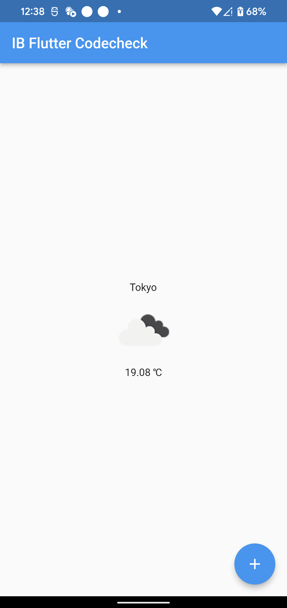

# flutter_coding_test

このリポジトリは株式会社IBのFlutterエンジニア採用試験問題です。

## 実装するアプリケーションの仕様

### 必須課題

[OpenWeatherMap API](https://openweathermap.org/)を用いて、[東京](https://openweathermap.org/city/1850147)の天気(天気・気温)を表示するアプリケーションを作成してください。
- UIをどう実装するかは問いません。
- [pubspec.yaml](./pubspec.yaml)に最低限のパッケージを追加していますが、パッケージを導入しても構いません。

以下は参考実装のUIですが、自由に実装して構いません。

実装が完了したら、どのような設計を行ったか・実装でのアピールポイント・実装上で困ったことについて、[retrospective.md](./retrospective.md)に記載してください。

### 発展課題

必須課題で作成したアプリケーションに対して機能の拡張を行ってください。

- テストの追加
- 天気を表示する地域を追加出来るようにする
- 昨日の天気や今日の天気を時間毎に閲覧できるか

## 評価点

- 0 -> 1の設計・実装を通して、設計力や思想・および普段どのような環境で実装しているのかを図る
  - ライブラリ選定
  - ディレクトリ構成
  - linter・コーディング規約
- 1 -> 10の追加設計・実装を通して、既存のコードベースの意図を汲み取った実装・設計が行えるかを図る
  - Open-closedなど拡張性のある実装・設計
  - 単一責任原則や驚き最小の原則など、チーム開発において他の開発者が意図を汲み取りやすい実装
  - 自動テスト設計

## 実装項目と評価ポイント

### ライブラリのインストール

- 必須: 必要なライブラリを`pubspec.yaml`に追加できているか
- 発展: dependenciesとdev_dependenciesを適切に使い分けているか

### ディレクトリ構成・設計

- 必須: 設計意図が汲み取れるディレクトリ構成となっているか
- 発展: アプリケーションの拡張に対応できる構成となっているか

### APIリクエスト

- APIキーを直接ソースコードに書き込んでいないか
- JSONレスポンスのパースができているか・またはライブラリを用いれているか
- APIレスポンスのエラーハンドリングができているか
- 発展: ネットワークを介する処理のテストが記述できているか

### モデルクラス

- APIレスポンスをアプリケーションで用いるドメインモデルにマッピングできているか
- 発展: モデルクラスのテストが記述できているか
- TODO: モデルクラスが担当するべき責務をなんかしら用意したい、適切にモデルに記述できるか見たい

### リポジトリ

- 発展: APIリクエストを集約するレイヤが用意されているか

### UI

- 必須: 今日の東京の天気(天気・気温)が閲覧できるか
- 必須: 非同期処理をUI側で適切にハンドリングできているか
- 必須: ウィジェット毎に責務の切り分けができているか
- 発展: 表示する地域・地方をアプリケーション上で選択・登録できるか
- 発展: 昨日の天気や今日の天気を時間毎に閲覧できるか
- 発展: ウィジェットテストが記述できているか

### その他

- 設計意図や複雑な処理に対してコメント・ドキュメントが適切に行えているか
- Gitのコミットメッセージやコミット粒度が適切か
- Linterの設定が適切に強化できているか
